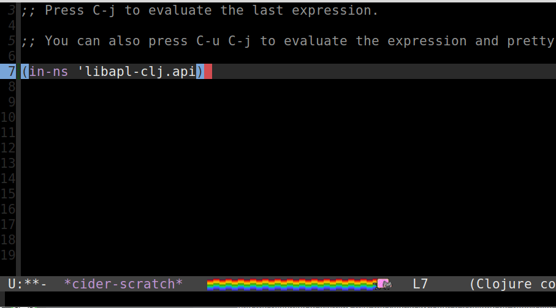

[](https://clojars.org/jjtolton/libapl-clj)



# libapl-clj

Following in the footsteps of [libpython-clj](https://github.com/clj-python/libpython-clj)
and [libjulia-clj](https://github.com/cnuernber/libjulia-clj), libapl-clj provides native
interop from Clojure into [GNU APL](https://www.gnu.org/software/apl/).

## Status

Pre-alpha: APL shared library is able to be loaded on Linux. 
* Arbitrary APL strings can be run, and the values can be extracted into strings.
* APL<->Clojure data copy is accomplished easily
* Zero-copy paradigm supported
* There are system instabilities, your REPL may crash from time to time.
* automatic GC not yet implemented

## Overview

APL is a fantastic tensor processing language with a ton of power. It's work has been
hugely inspirational to libraries like Python's [numpy](https://numpy.org/) and
[dtype-next](https://cnuernber.github.io/dtype-next/).

The aim of this library is to provide native interop for APL from Clojure.

## Usage

Tested on Linux Mint 19. Should also work on MacOS and probably Windows if you
know how to set environment variables (see below).

1. Follow the directions to [download GNU APL](https://www.gnu.org/software/apl/).
2. When installing APL, use the following options:
```bash
make develop_lib
sudo make install
```
3. The default shared library installation path is `/usr/local/lib/apl`. The filename
is `libapl.so`. If `libapl.so` is installed somewhere else, please set your `APL_LIBRARY_PATH`
environment variable to the correct path before running `initialize!`.

## Example

```clojure
(require '[libapl-clj.apl :as apl])

apl/+
;;=> #function[libapl-clj.prototype/jvm-fn/fn--23227]
(apl/+ 1 2)
;;=> 3
(apl/+ [1 2 3] [4 5 6])
;;=>
#tech.v3.tensor<object>[3]
[5 7 9]

(display! (apl/+ [1 2 3] [4 5 6]))

┏→━━━━┓
┃5 7 9┃
┗━━━━━┛

(apl/× [1 2 3] [4 5 6])
;;=> #tech.v3.tensor<object>[3]
[4 10 18]

(apl/⍴ [2 3 5] (first "a"))
;;=>
#tech.v3.tensor<object>[2 3 5]
[[[a a a a a]
  [a a a a a]
  [a a a a a]]
 [[a a a a a]
  [a a a a a]
  [a a a a a]]]

(display! (apl/⍴ [2 3 5] (first "a")))
;;=>
┏→━━━━┓
↓aaaaa┃
┃aaaaa┃
┃aaaaa┃
┃     ┃
┃aaaaa┃
┃aaaaa┃
┃aaaaa┃
┗━━━━━┛

(apl/reduce apl/⌈ [[1 2 3] [3 5 6] [1 2 3]])
#tech.v3.tensor<object>[3]
[3 6 3]

(apl/reduce apl/⌈ 1 [[1 2 3] [3 5 6] [1 2 3]])
#tech.v3.tensor<object>[3]
[3 6 3]

```

## Roadmap

### Alpha-release
* [x] Push to Clojars 
* [x] Marshall pointers to native Clojure datatypes 
* [x] Zero-copy pathway between APL and Clojure for monster performance 
* [x] Ergonomic Clojure API
* [ ] Documentation
* [ ] Tests

### Beta-release
* [ ] User-defined APL functions
* [ ] APL function combinators

### 1.0 Release
* [ ] Garbage Collection
* [ ] Remove reflection
